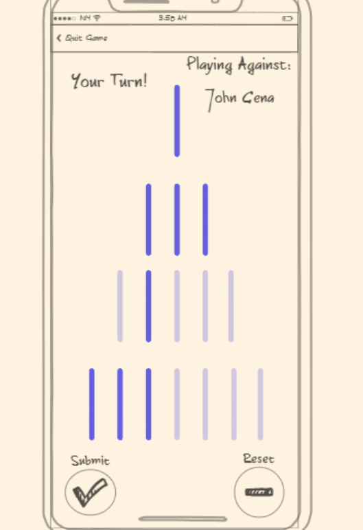

# NIM Player

## JavaScript deliverable

Most of the basic features are implemented in JavaScript, with artificial data being generated and returned to simulate database interactions. Local play is fully supported (and online play is functionally equivalent to it for now).

- *Login authentication*: a valid username and password (nearly anything except the empty string) are required to authenticate, and pages redirect to the login screen if a valid authtoken is not found
- *Gameplay*: all game rules, win conditions, and player turn tracking logic are represented using JavaScript classes and functions
- *Dynamic HTML/CSS*: nearly all event listeners (onclick, onload, etc) are implemented with DOM manipulations rather than HTML properties, info and alert boxes are dynamically shown and hidden, and the entire board is generated from JavaScript
- *Modules*: message style is consistent across pages through a single `message-display` module
- *Simulated server communication*: data is sent through JavaScript Promises to a simulated server, which generates and returns accurate (albeit artificial) responses for both database access (ex. when sending a game request) and WebSocket communication (ex. during gameplay)
- *Persistent data*: usernames, game states, authtokens, and other data is stored in the browser's localStorage

## CSS deliverable

I added CSS styling using Bootstrap on every page to create a simple but nice design that I'm happy with (although I'm sure I'll keep fiddling with details through the whole project).

- *Header and footer*: every page has a standardized header and footer with navigation links.
- *Main content body*: context is organized using flexbox into nice-looking elements.
- *Navigation elements*: each page has a home link and logout button in the header, with page-specific navigation buttons built into the main page content but with a consistent style.
- *Responsive design*: everything is built using flexbox and responsive design, so it works well on nearly any device.
- *Application elements*: main page content uses Bootstrap styling.
- *Application text content*: I simplified and streamlined text, using styling to create a consistent feel.
- *Application images*: I changed the hardcoded board images into flexbox-styled elements, so they automatically space themselves according to the device.

## HTML deliverable

I outlined every page using hardcoded HTML as a structural skeleton of the eventual functionality I want to add.

- *HTML pages*: Each page is structured using placeholder HTML.
- *Links*: Every page has links to the pages relevant to it (including placeholder links for redirects or gamestates), including home links in the header.
- *Text*: There's a brief description or welcome on each page.
- *Images*: Placeholder images are used as hardcoded icons on the game board.
- *Login*: Username and password input form with placeholder buttons and links.
- *Database*: Placeholder statistics page including account information and game stats.
- *WebSocket*: Placeholder board page for live play with other users.

## Description Deliverable

### Elevator Pitch

Are you tired of losing games just because of luck? Do you want a fun game that you can work at until you always win? NIM Player presents a game complex enough to be a challenge, but simple enough that anyone can become a master with practice. Play live against your friends until you can win every time! Finally, once you've mastered the game, you'll unlock _The Ultimate Algorithm_--which can mathematically guarantee your victory against your friends (or enemies)!

### Key Features

- User authentication through HTTPS
- How-to-Play tutorial
- Personal stats saved and shown to the user
- Live play with other users
- Leaderboard of NiMasters
- 100% (un)original algorithm guaranteed by the Laws of Mathematics to be a winning strategy* _(AssumingConsistencyOfZermeloFrankelSetTheoryWithChoice. RestrictionsMayApply. AskYourDoctorIfTheLawsOfMathematicsAreRightForYou.)_

#### To add if I have time

- Global statistics
- Multiple gamemodes
- Singleplayer against the computer

### Technology

- HTML and CSS: Login screen, gameboard, stats page, tutorial, suitable chastisement for suboptimal play
- JavaScript: gameplay, board functionality
- Web service: Remote calls for authentication, retrieving statistics
- Authentication: creating accounts and logging in
- Database persistence: account information, game statistics, leaderboard of top players
- WebSocket: live play with other users
- Web framework: ported to the React framework

